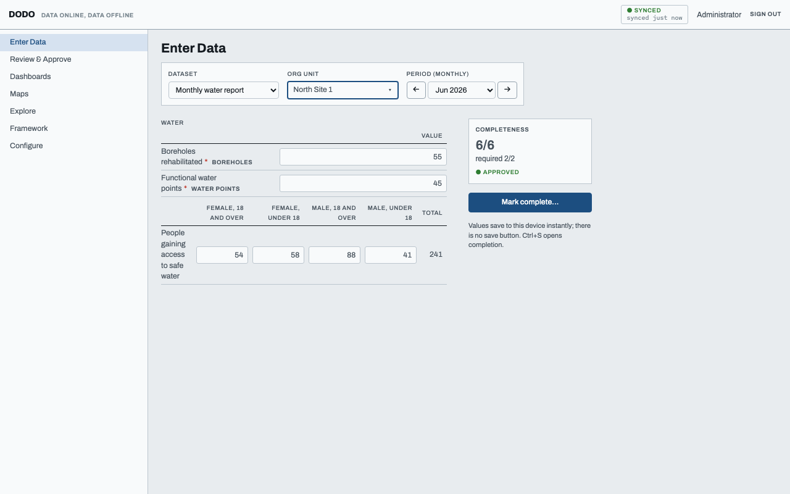
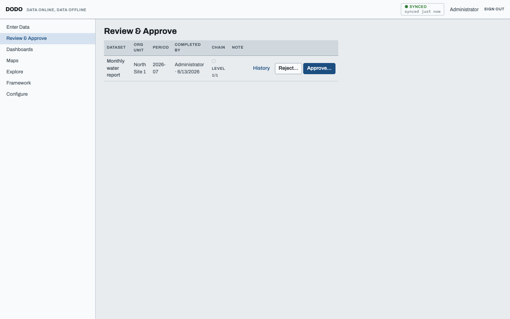
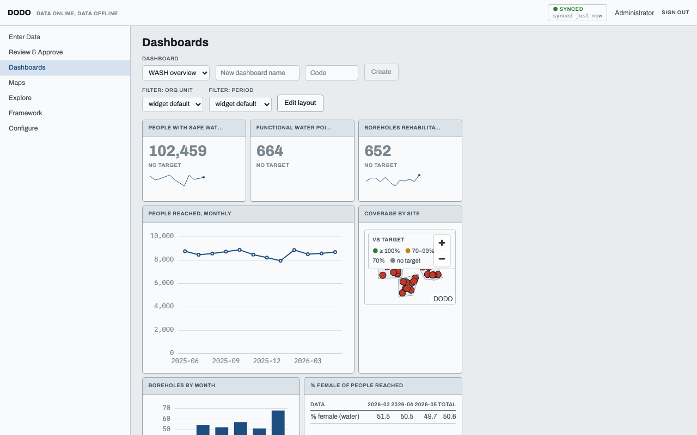
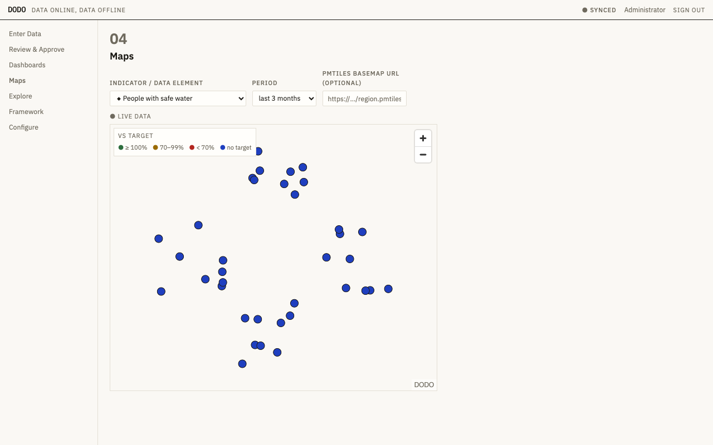
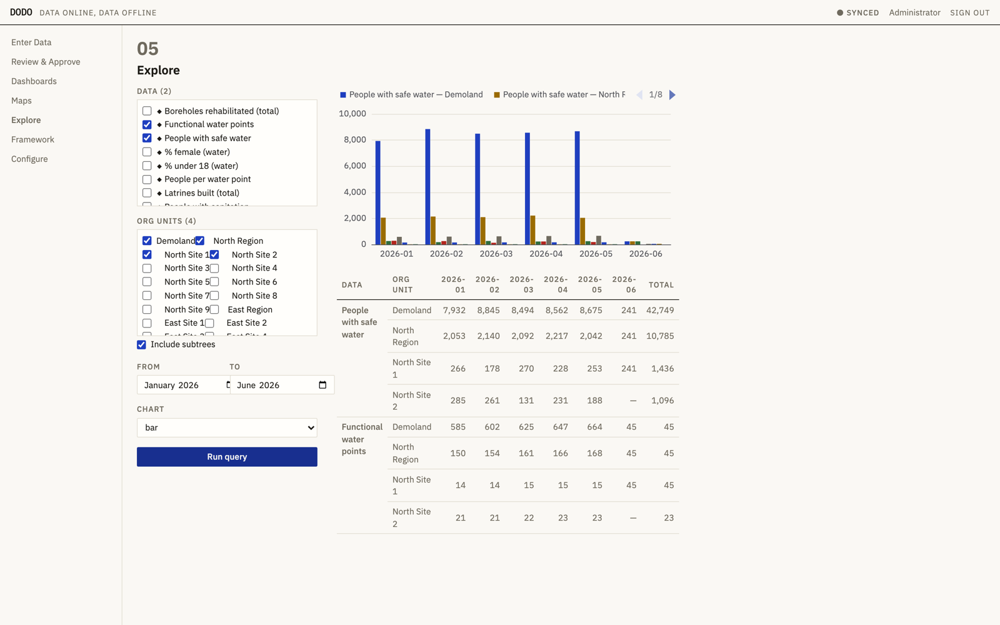
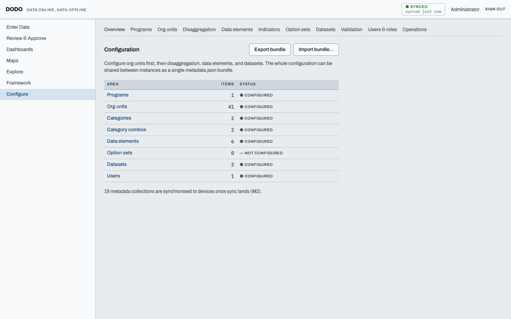

# DODO — Data Online, Data Offline

Open-source (MIT), self-hostable, **offline-first** indicator data
collection and M&E platform. Field users enter data in their browser; it is
stored on the device and synchronized when connectivity returns. Program
managers configure everything — indicators, disaggregations, org units,
forms, validation, approvals, dashboards, and maps — through the UI.



## Why DODO

- **Browser-offline-first.** No native app. The PWA installs from the
  browser, the entire app shell is precached, and every read/write hits the
  on-device database first. Sync is asynchronous replication with
  idempotent, replay-safe pushes and conflict detection that surfaces to
  humans — never silent last-write-wins.
- **Indicator-centric.** Continuous reporting against a results framework:
  periods, disaggregation (category combos), targets and baselines,
  validation rules, approval chains — the proven DHIS2 conceptual model,
  reimplemented as a small TypeScript system.
- **Light to operate.** One server container + PostgreSQL/PostGIS + Caddy.
  Single-VM friendly, `pg_dump` backups, configuration shared as one
  `metadata.json` bundle.

## The interface — seven workspaces

The app is a "Field Instrument": a dense, keyboard-first interface on cool
blueprint-gray surfaces, with a persistent **Sync Gauge** that always shows
live connectivity and how much unsynced offline work is outstanding. Every
chart, map, table, and form sits in a framed panel; light and dark themes both
ship. The left rail moves between the seven workspaces below.

### 1. Enter Data

Spreadsheet-style entry: visible, keyboard-navigable cells with per-cell
save / sync / warning / error / conflict states, automatic disaggregation
totals, per-section completeness, and a **Mark complete** flow that runs every
validation rule. Values save to the device instantly — there is no save
button. Closed and future periods cannot be selected (the period stepper is
bounded by the dataset's frequency, `open future periods`, and `expiry days`).
Where a data element requires evidence, an attachments panel under its row
captures a photo, GPS fix, audio clip, or file — held on the device and
uploaded with the next sync.

(Pictured at the top of this page.)

### 2. Review & Approve

The submission queue: completed datasets flow up a configurable approval
chain. Reviewers approve or reject (with a reason) level by level, with full
history per submission.



### 3. Dashboards

A drag-resize grid of KPI, chart, map, pivot, and text widgets. Last-fetched
results are cached, so dashboards render **offline** with a "data as of"
stamp. Relative periods ("this year", "last 12 months") aggregate the
underlying monthly data correctly.



### 4. Maps

MapLibre choropleth of org-unit boundaries and facility points coloured
against target thresholds (● ≥100% / ● 70–99% / ● <70%), drawn entirely from
the on-device mirror with **zero external tiles**. A deployer can layer in an
optional self-hosted PMTiles basemap; without one, the geometry itself is the
map.



### 5. Explore

An ad-hoc pivot + chart builder over the analytics API: pick data elements
and indicators, org units (with subtrees), and a period range, then pivot or
chart the result. Legends sit outside the plot; tables honour the compact /
comfortable density toggle.



### 6. Framework

Results frameworks — trees that indicators hang from, with targets and
baselines per org unit. v0.2.0 adds **multiple configurable frameworks per
program** (USAID, BMGF, internal…): custom level names, one indicator mapped
into several frameworks at once, per-framework disaggregation filters and
targets, and a RAG dot against each framework's own target. This is the
structure dashboards and the target-vs-actual colouring on Maps report
against.

### 7. Configure

The metadata hub: programs (project containers with custom fields), org-unit
hierarchy (with selective shapefile import), disaggregation (categories and
combos, including nested option trees), data elements (with photo/GPS/document
evidence requirements), indicators, results frameworks, configurable RAG
thresholds, option sets, datasets and their forms, export templates (fill a
donor's own spreadsheet or generate one), API keys, validation rules, and
users & roles. Metadata is server-authoritative and versioned, and the whole
configuration exports/imports as a single `metadata.json` bundle.



## Quick start

```sh
docker compose up --build -d         # server + postgres/postgis + caddy on :8080
pnpm --filter @dodo/server seed      # optional: WASH demo — 40 org units with
                                     # geometry, 12 indicators, 18 months of data,
                                     # targets, and a ready-made overview dashboard
```

Sign in as `admin` / `admin` (change it immediately). See the
[administrator guide](docs/admin-guide.md) and the
[field guide](docs/field-guide.md).

## Development

Node 22 + pnpm 11 + Docker (for Postgres and integration tests).

```sh
pnpm install
docker compose up -d db
pnpm dev          # fastify :3000 + vite :5173
pnpm test         # unit + integration (testcontainers)
pnpm e2e          # playwright incl. the offline scenarios
```

`/dev/styleguide` renders every UI primitive, the panel, and the Sync Gauge in
all states, in light and dark — a quick visual reference while developing.

Repository layout:

```
packages/shared    zod schemas, period logic, expression engine, validation
packages/server    fastify app, drizzle schema, migrations, sync protocol
packages/web       vite react pwa (dexie, sync engine, entry grid, dashboards)
e2e/               playwright, incl. offline & conflict scenarios
```

Design language: [docs/design-language.md](docs/design-language.md) ·
Release notes: [docs/changelog.md](docs/changelog.md) ·
Contributing: [CONTRIBUTING.md](CONTRIBUTING.md)

## License

MIT — see [LICENSE](LICENSE). Map basemaps via
[Protomaps](https://protomaps.com) are © OpenStreetMap contributors (ODbL).
